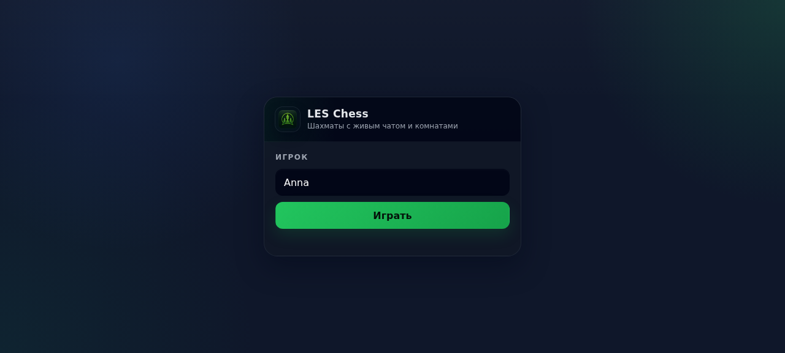
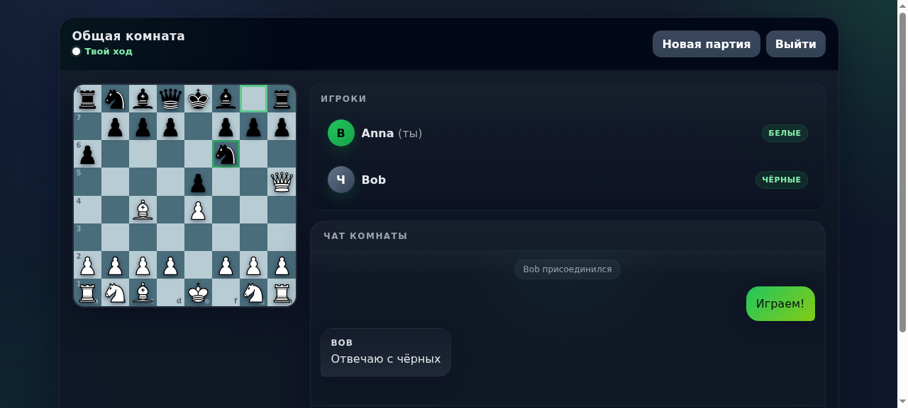
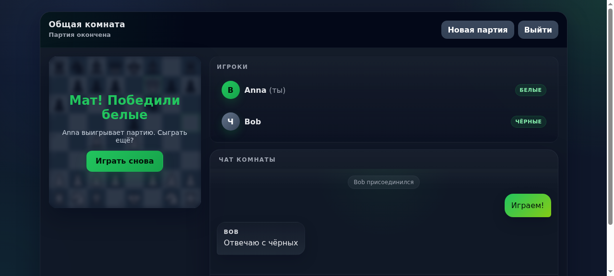
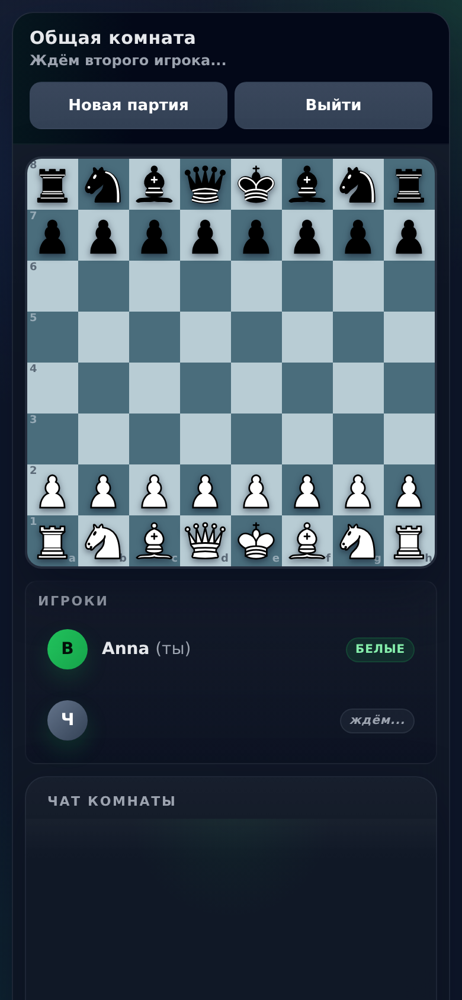
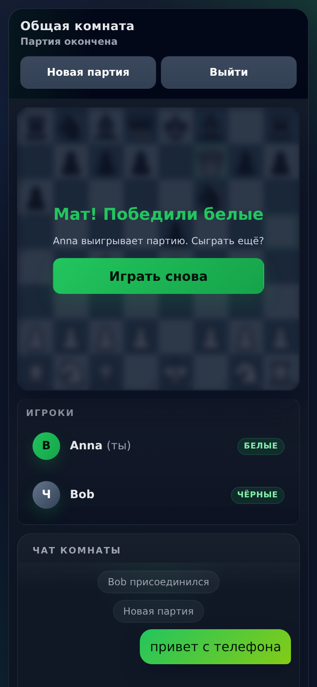

<div align="center">


# ♟️ LESchess

**Локальные веб-шахматы с живым чатом и отдельными комнатами**

[](https://www.python.org/)
[](https://developer.mozilla.org/en-US/docs/Web/API/WebSocket)
[](https://pypi.org/project/chess/)
[](https://www.gnu.org/licenses/gpl-3.0)
[](https://pytest.org/)

</div>

---

## 📋 Содержание

- [📖 Описание проекта](#-описание-проекта)
- [✨ Возможности](#-возможности)
- [📸 Скриншоты](#-скриншоты)
- [🚀 Быстрый старт](#-быстрый-старт)
- [🔌 Протокол WebSocket](#-протокол-websocket)
- [🧪 Тестирование](#-тестирование)
- [📁 Структура проекта](#-структура-проекта)
- [🚢 Развёртывание](#-развёртывание)
- [📄 Лицензия](#-лицензия)

---

## 📖 Описание проекта

**LESchess** — локальные веб-шахматы для игры вдвоём в браузере. Один Python-файл бэкенда (движок — [python-chess](https://pypi.org/project/chess/)) без внешних сервисов и базы данных: комнаты, полная валидация правил, чат в реальном времени и интерфейс в фирменном стиле LESogram.

### 🎯 Цели проекта

- **Простота** — вся игра в одном файле `server.py` + один `index.html`
- **Живое время** — WebSocket синхронизирует доску и чат мгновенно
- **Комнаты** — пары играют параллельно, не мешая друг другу
- **Удобство** — интерфейс как в LESogram: тёмная тема, стеклянные панели, адаптивность

---

## ✨ Возможности

- ♟️ **Полные правила шахмат** (python-chess): валидация на сервере, рокировки, взятие на проходе, шах, мат, пат, превращение пешек, ничьи (3-кратное повторение, 50 ходов, недостаток материала)
- ✋ **Drag-and-drop** — фигуры можно переставлять перетаскиванием (мышь и тач) или кликом, с подсветкой допустимых клеток и «призраком» фигуры под пальцем
- 🏠 **Лобби с комнатами** — живой список комнат, создание с собственным названием и паролем, вход по паролю (замок у закрытых комнат), до 2 игроков в каждой
- 💬 **Чат игроков** — пузыри в стиле LESogram, системные сообщения о входе/выходе
- 🎨 **Фирменный дизайн** — тёмная тема `#0f172a` + зелёный акцент `#22c55e`, Trebuchet MS, радиусы 22/16/12, стеклянные панели с blur
- 🔄 **Синхронизация в реальном времени** — ход, чат, подключение соперника
- 🤝 **Реванш** — кнопка «Новая партия» после мата
- ↩️ **Отмена хода** — по запросу, с согласием соперника (откатывается пара полуходов)
- ½ **Ничья по соглашению** — предложение и согласие/отказ
- ⚑ **Сдача** — с подтверждением; победа присуждается сопернику
- ⏱ **Контроль времени на ход** — при создании: пресеты или своё значение (5–600 сек); просрочка = поражение, таймер в бейдже хода (красный пульс на последних 10 сек)
- 🔄 **Смена лимита в комнате** — кнопка «⏱ Время»: только до первого хода, не пересоздавая комнату
- 🎲 **Смена сторон после партии** — «Новая партия» меняет белых/чёрных местами
- 📱 **Адаптивность** — доска масштабируется под экран, мобильная раскладка
- 🔃 **Переподключение** — клиент автоматически восстанавливает WS-соединение
- 🖼️ **Поворот доски** — чёрные играют со своей стороны
- 💡 **Подсказки ходов** — точки на свободные поля, обводка на взятия, подсветка шаха
- 👑 **Превращение пешки** — выбор фигуры (♕♖♗♘) при достижении последной горизонтали, ферзь по умолчанию
- ⚡ **Ход наперёд (premove)** — пока соперник думает, заготовь свой ход кликом по фигуре и цели: придёт твоя очередь — применится автоматически; стал нелегален — отменится с уведомлением
- 📜 **История ходов** — панель с шахматной нотацией (SAN): «1. e4 e5 2. f4 …», текущий ход подсвечен

---

## 📸 Скриншоты

<details>
<summary>Нажмите, чтобы развернуть</summary>

- Экран входа <br>


- Комната с доской и чатом <br>


- Партия, мат и оверлей победы <br>


- Мобильная версия (390px) <br>


- Мат на телефоне <br>


</details>

---

## 🚀 Быстрый старт

### 📋 Предварительные требования

- **Python** `3.10` или выше
- **pip** (менеджер пакетов Python)

### 🔽 Установка

```bash
git clone https://github.com/Filldor2033/LESchess.git
cd LESchess

python -m venv .venv
source .venv/bin/activate        # Windows: .venv\Scripts\activate

pip install websockets chess
```

### ▶️ Запуск

```bash
python server.py
```

Приложение поднимается на двух портах:

- **HTTP (интерфейс):** `http://localhost:8090/`
- **WebSocket (игра и чат):** `ws://localhost:8091/`

Откройте `http://localhost:8090/` в **двух** вкладках или на двух устройствах, введите разные имена — и играйте. Второй игрок получает чёрные фигуры.

> 💡 В сети LAN/интернете укажите IP хоста — фронтенд строит WS-адрес из `location.host` автоматически.

---

## 🔌 Протокол WebSocket

### Клиент → Сервер
| Сообщение | Описание |
|---|---|
| `{type: 'list'}` | подписка на живой список комнат (лобби) |
| `{type: 'create', name, password, playerName}` | создать комнату с названием и паролем |
| `{type: 'join', name, room, roomName, password}` | войти в комнату (пароль — если закрыта) |
| `{type: 'undo'}` | предложить отмену последнего хода (согласие соперника) |
| `{type: 'draw'}` | предложить ничью (согласие соперника) |
| `{type: 'answer', kind, ok}` | ответ на запрос соперника (undo/draw) |
| `{type: 'resign'}` | сдаться (с подтверждением на клиенте) |
| `{type: 'move', ..., promote}` | превращение пешки: Q/R/B/N (без поля — ферзь) |
| `{type: 'premove', from, to}` | заготовить ход наперёд (`clear: true` — снять) |
| `{type: 'create', ..., moveTime}` | лимит на ход: 0 или 5–600 сек |
| `{type: 'settime', moveTime}` | сменить лимит в комнате (часы перезапускаются) |
| `{type: 'leave'}` | выйти из комнаты (освобождает цвет сразу) |

Все сообщения — JSON.

### Клиент → Сервер

| Тип | Поля | Описание |
|---|---|---|
| `join` | `name`, `room`, `roomName` | Войти в комнату (создаётся при отсутствии) |
| `move` | `from`, `to` | Ход `[x, y] → [x, y]` |
| `moves` | `x`, `y` | Запросить допустимые ходы фигуры |
| `chat` | `text` | Сообщение в чат (до 500 символов) |
| `reset` | — | Новая партия |

### Сервер → Клиент

| Тип | Поля | Описание |
|---|---|---|
| `welcome` | `name`, `color`, `room`, `state`, `players`, `chat` | Ответ на вход |
| `move` | `from`, `to`, `state` | Ход + новое состояние |
| `state` | `state` | Состояние партии |
| `moves` | `x`, `y`, `moves` | Допустимые ходы |
| `players` | `players` | Белый/чёрный игроки |
| `chat` | `name`, `text`, `ts` | Сообщение чата |
| `system` | `text`, `state?` | Системные события |
| `error` | `text` | Ошибка («Не ваш ход», «Комната заполнена»…) |

`state` — состояние партии: `board` (8×8), `turn`, `status` (`active`/`checkmate`/`stalemate`), `result`, `inCheck`, `material`.

---

## 🧪 Тестирование

E2E-тест гоняет полный сценарий через реальный WebSocket-сервер: вход двух игроков, чат, подсказки ходов, детский мат (`e4 e5 Bc4 a6 Qh5 Nf6 Qxf7#`), определение победы, сброс, отказ третьему игроку.

```bash
python server.py &     # сервер должен быть запущен
python e2e_test.py
```

---

## 📁 Структура проекта

```
LESchess/
├── server.py           # Весь бэкенд: HTTP-статика + WS + правила шахмат
├── index.html          # Весь фронтенд: интерфейс, доска, чат
├── e2e_test.py         # E2E-тесты (pytest-совместимый сценарий)
├── requirements.txt    # websockets + chess + pytest
├── logo.png            # Логотип (король и ёлки)
├── favicon-*.png       # Фавиконы 512/192/48/32/16
├── apple-touch-icon.png
├── screenshots/        # Скриншоты для README
├── .github/workflows/  # CI: тесты на push
└── LICENSE             # GPLv3
```

---

## 🚢 Развёртывание

### systemd (прод)

```ini
[Unit]
Description=LESchess
After=network.target

[Service]
WorkingDirectory=/opt/leschess
ExecStart=/opt/leschess/.venv/bin/python server.py
Restart=always

[Install]
WantedBy=multi-user.target
```

Порты 8090 (HTTP) и 8091 (WS) пробрасываются/открываются отдельно. Для HTTPS поставьте Caddy/nginx перед 8090 и проксируйте `/` и WS-апгрейд на 8091.

---

## 📄 Лицензия

<div align="center">

Данный проект распространяется под лицензией **GPL-3.0**.

[](https://www.gnu.org/licenses/gpl-3.0)

**© 2026 LESchess**

</div>

---

## 🧩 Другие проекты

<div align="center">

**LESogram** — мой мессенджер с обменом текстовыми и медиа сообщениями в реальном времени.
Если интересно — заходи, смотри:

👉 **[github.com/Filldor2033/LESogram](https://github.com/Filldor2033/LESogram)**

</div>

---

<div align="center">

### ⭐ Если вам понравился проект, поставьте звёздочку на GitHub!

</div>
